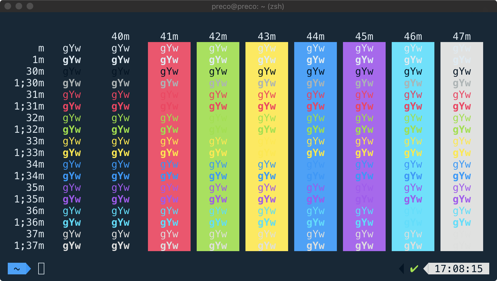

# iterm2-aqua

> :droplet: Deep dark theme for iTerm2, but with pastel colors

## Install

- Download theme (right-click and choose _Save Link As…_): [`aqua.itermcolors`](https://github.com/preco21/iterm2-aqua/raw/master/aqua.itermcolors).
- Double-click the downloaded file to install.

## License

[MIT](http://preco.mit-license.org/)
